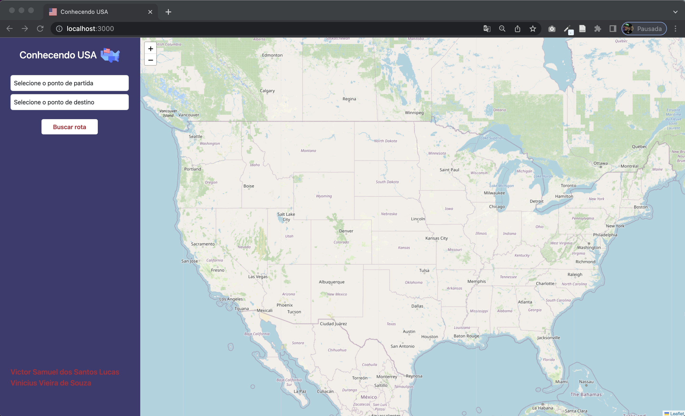

# Grafos2_ConhecendoUSA

**Número da Lista**: Dupla 4<br>
**Conteúdo da Disciplina**: Grafos 2<br>

## Alunos
|Matrícula | Aluno |
| -- | -- |
| 18/0028685  |  Victor Samuel dos Santos Lucas |
| 17/0115500  |  Vinícius Vieira de Souza |

## Sobre 
Este projeto tem como objetivo servir como base para implementação de algoritmos relacionados a estudos voltados ao conteúdo de Grafos 2.

O projeto em questão se trata de uma aplicação onde através da implementação do algoritimo de Dijkistra se é apresentado o caminho mais curto em termos de distância(km) entre a origem e destinos escolhidos pelo usuário. Para isso se é contruído um grafo contendo as cidades capitais dos estados de EUA. 

Na aplicação o usuário poderá escolher entre uma cidade capital de origem e outra de destino. Feito isso será exibido uma marcação das cidades capitais a serem percorridas para chegar ao destino

## Screenshots
#### Página Inicial


#### Menor Caminho entre Olympia - WA  e Augusta - ME

</br>


#### Menor Caminho entre Olympia - WA  e Montgomery - AL


#### Menor Caminho entre Olympia - WA  e Helena - MT


## Instalação 
**Linguagem**: Javascript (Frontend/Backend)<br>
**Framework**: Node.js (Backend) / React (Frontend)<br>
Descreva os pré-requisitos para rodar o seu projeto e os comandos necessários.

## Requisitos:
- Node: Versão 16+
- Npm: Versão 6+

## Uso 
### Passo 1: 
Entre no diretorio do /backend e execute o seguinte comando
```terminal
npm install 
```
### Passo 2:
Ainda no diretorio do backend, coloque o servidor pra rodar com o comando:
```terminal
node src/server.js ou nodemon src/server.js
```
### Passo 3:
Em outro terminal entre no diretorio do /frontend e execute o seguinte comando:
```terminal
npm install
```
### Passo 4:
Ainda no deretorio do /frontend coloque o front para rodar com o comando:
```terminal
npm start
```

### Passo 5:
Caso não abra automáticamente, para acessar a aplicação abra seu navegador no seguinte endereço: http://localhost:3000

## OBS:
- O backend e frontend fazem uso respectivamente das portas: http://localhost:8080 e http://localhost:3000, dessa forma certifique-se de que estejam livres para rodar a aplicação.

## Vídeo de Apresentação


